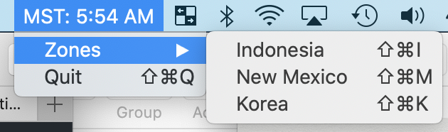

# SMMTZC---Simple-Menubar-Multi-Time-Zone-Clock

A simple menubar application to show the time in different time zones. 

SMMTZ was born out of the need for an easy way to glance at the time in multiple timezones.
The standard MacOS clock shows only one time zone, but what if you frequently communicate with people in two time zones? Or three? 

SMMTZ was originally written in Swift 3 while I was serving in the Peace Corps in Indonesia, but frequently communicating with family and colleagues in North Carolina, New Mexico, and South Korea. I was not a talented Swift developer then, and I am not a talented Swift developer now - I'm just using it to solve this problem for myself. 

SMMTZ has recently been updated from Swift 3 to Swift 5. *It currently displays one extra clock in the menubar. Three time zones for this clock are selectable from a simple drop-down menu. They are hard coded to the time zones I check most often - Indonesia, New Mexico, and South Korea.* 

**Are you a more talented Swift developer than me?** Feel free to contribute! 

