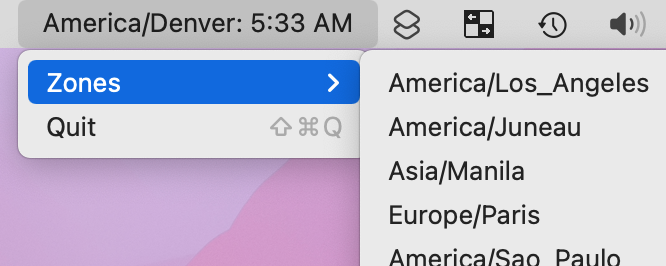

# SMMTZC---Simple-Menubar-Multi-Time-Zone-Clock

A simple menubar application for MacOS to show the time in different time zones. 

**Download the .app file in the releases by [clicking here.](https://github.com/zhanknight/SMMTZC---Simple-Menubar-Multi-Time-Zone-Clock/releases)**

SMMTZ was born out of the need for an easy way to glance at the time in multiple timezones.
The standard MacOS clock shows only one time zone, but what if you frequently communicate with people in two time zones? Or three? 

SMMTZ was originally written in Swift 3 while I was serving in the Peace Corps in Indonesia, but frequently communicating with family and colleagues in North Carolina, New Mexico, and South Korea. I was not a talented Swift developer then, and I am not a talented Swift developer now - I'm just using it to solve this problem for myself and, hopefully, help others too. It's been updated to Swift 5!

**Are you a more talented Swift developer than me?** Feel free to contribute! 

